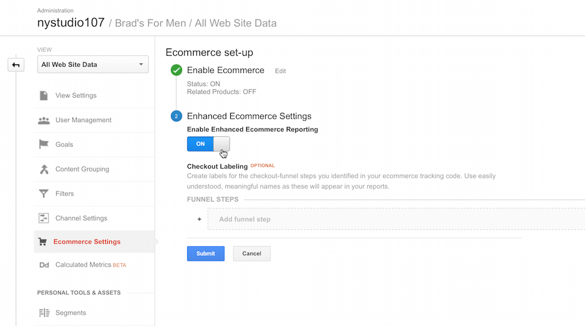

# Using Instant Analytics

## Simple Page Tracking

Once you've entered your **Google Analytics Tracking ID**, Instant Analytics will automatically send PageViews to Google Analytics if you have **Auto Send PageViews** on (which it defaults to). There is no step 2.
  
 If you need to control which pages Instant Analytics sends PageViews on, set **Auto Send PageViews** to `off`.  Then you just need to add a call to `` to your front-end templates to send PageView tracking to Google Analytics.  We recommend that you do this in a block at the bottom of your `layout.twig` template that other templates extend, right before the `</body>` tag, like this:

```twig
    
        
    
```

That's it!  Once you have added this hook, Instant Analytics will start sending PageViews to Google Analytics. It does not send any Google Analytics data if:

* You have not entered a valid **Google Analytics Tracking ID:**
* You are viewing templates in Live Preview
* The request is a CP or Console request
* If you have `sendAnalyticsData` set to false in the `config.php` file

By default, the "title" used for your pages is the current template path; if you have [SEOmatic](https://github.com/nystudio107/seomatic) installed, Instant Analytics will automatically grab the current page title from it.

Instant Analytics will also automatically parse and set any [UTM query string parameters](https://blog.kissmetrics.com/how-to-use-utm-parameters/) such as `utm_campaign`, `utm_source`, `utm_medium`, and `utm_content` in the analytics object.

### Advanced Page Tracking

This is where the fun begins.  Instant Analytics injects an `instantAnalytics` object into your templates, the same way that Craft injects an `entry` object or Craft Commerce injects a `product` object.  This is the actual `Analytics` object that the `` will send to Google Analytics.

You can manipulate this object as you see fit, adding data to be sent to Google Analytics along with your PageView.

For example, let's say that you want to add an `Affiliation`:

```twig
    
```

Or perhaps for a particular page, you want to change the the `Tracking ID` used by Google Analytics:

```twig
    
```

Or do them both at the same time:

```twig
    
```

You can add or change any property defined in the [Google Analytics Measurement Protocol library for PHP](https://github.com/theiconic/php-ga-measurement-protocol) that Instant Analytics uses.

By default, the injected `instantAnalytics` object is filled in with the following info:

* `instantAnalytics.setProtocolVersion('1')`
* `instantAnalytics.setTrackingId(YOUR_TRACKING_ID)`
* `instantAnalytics.setIpOverride($_SERVER['REMOTE_ADDR'])`
* `instantAnalytics.setUserAgentOverride($_SERVER['HTTP_USER_AGENT'])`
* `instantAnalytics.setDocumentReferrer($_SERVER['HTTP_REFERER'])`
* `instantAnalytics.setClientId(CID)`
* `instantAnalytics.setDocumentPath(craft.request.url)`
* `instantAnalytics.setDocumentTitle(TEMPLATE_PATH)`

If the SEOmatic plugin is installed, then it is used to set the title:

* `instantAnalytics.setDocumentTitle(seomaticMeta.seoTitle)`

If there is a `gclid` cookie (used for Google AdWords tracking), this will also be set:

* `instantAnalytics.setGoogleAdwordsId(GCLID)`

## Craft Commerce Tracking with Google Enhanced Ecommerce

If you are using Craft Commerce, Instant Analytics will recognize this, and automatically send Google Enhanced Ecommerce data for the following actions:

* **Add to Cart** - When someone adds an item from your Craft Commerce store to their cart.  This will include data for the Product or Variant that was added to the cart.
* **Remove from Cart** - When someone removes an item from your Craft Commerce store cart (requires Craft Commerce 1.2.x or later).  This will include data for the Product or Variant that was removed from the cart.
* **Purchase** - When someone completes a purchase in your Craft Commerce store.  This will include all of the LineItems that were added to the cart, as well as the TransactionID, Revenue, Tax, Shipping, and Coupon Code used (if any).

You simply need to enable Enhanced Ecommerce in your Google Analytics Admin area for your website's property:



That's it!  It'll just work.  In addition to the basic automatic tracking that Instant Analytics does, you can use the `instantAnalytics` object to send additional data to Google Analytics Enhanced Ecommerce:

* `` - This will add an _impression_ for a given Craft Commerce `Product` or `Variant` (you can pass in either in `PRODUCT_VARIANT`).  `INDEX` must be a number between 1-200, and is the position in the list of products where this product appears. This should be used on product listing pages that show a number of products, to indicate that the user has been shown a particular product. `LIST_NAME` and `LIST_INDEX` are optional; they let you set the product list name, and the index of that list, which is a number from 1-200, and should be unique to the list. `LIST_NAME` defaults to `default` and `LIST_INDEX` defaults to `1` if not specified.
*  `` - This will add a _product detail view_ for a given Craft Commerce `Product` or `Variant` (you can pass in either in `PRODUCT_VARIANT`).  This should be used when the user is shown the detail view of a product.
*  `` - This will add a _checkout step_ for a given Craft Commerce `CART` (obtained via `craft.commerce.cart`).  The `STEP` parameter lets you specify which step in the checkout process you are on, and the `OPTION` parameter is optional information you can associate with this checkout step, e.g.: `Shipping Info` or `VISA`.

You can set up names for each of the Checkout Steps in your Google Analytics Admin area for your website's property:


Once you are using these tags in your templates, Google Analytics Enhanced Ecommerce will be able to provide you with extended analysis of things like at what step in your Checkout process people abandon their carts, which products people are looking at detailed views of, etc.:


In addition to the expected sales data:


## Sending Events

You can obtain an `Analytics` object preloaded to send events to Google Analytics via either:

```twig
    
    -OR-
    
```

What `CATEGORY`, `ACTION`, `LABEL`, and `VALUE` are is completely up to you; you can provide whatever data makes sense for your application, and view it in Google Analytics.  See [Event Tracking](https://developers.google.com/analytics/devguides/collection/analyticsjs/events) for more information.

By default, the injected `instantAnalytics` object is filled in with the following info:

* `myAnalytics.setProtocolVersion('1')`
* `myAnalytics.setTrackingId(YOUR_TRACKING_ID)`
* `myAnalytics.setIpOverride($_SERVER['REMOTE_ADDR'])`
* `myAnalytics.setUserAgentOverride($_SERVER['HTTP_USER_AGENT'])`
* `myAnalytics.setDocumentHostName($_SERVER['SERVER_NAME'])`
* `myAnalytics.setDocumentReferrer($_SERVER['HTTP_REFERER'])`
* `myAnalytics.setClientId(CID)`
* `myAnalytics.setEventCategory(CATEGORY)`
* `myAnalytics.setEventAction(ACTION)`
* `myAnalytics.setEventLabel(LABEL)`
* `myAnalytics.setEventValue(VALUE)`

If there is a `gclid` cookie (used for Google AdWords tracking), this will also be set:

* `myAnalytics.setGoogleAdwordsId(GCLID)`

You manipulate the `myAnalytics` object as you see fit, adding or changing any property defined in the [Google Analytics Measurement Protocol library for PHP](https://github.com/theiconic/php-ga-measurement-protocol) that Instant Analytics uses.

However, the event **will not be sent** to Google Analytics until you tell it to via:

```twig
    
```

A complete example might be:

```twig
    
    
```

## Tracking Assets/Resources

Instant Analytics lets you track assets/resources that you can't normally track, by providing a tracking URL that you use in your front-end templates.

You can track as PageViews via either:

```twig
    {{ pageViewTrackingUrl(URL, TITLE) }}
    -OR-
    {{ craft.instantAnalytics.pageViewTrackingUrl(URL, TITLE) }}
```

Or you can track as Events via either:

```twig
    {{ eventTrackingUrl(URL, CATEGORY, ACTION, LABEL, VALUE) }}
    -OR-
    {{ craft.instantAnalytics.eventTrackingUrl(URL, CATEGORY, ACTION, LABEL, VALUE) }}
```

These can be wrapped around any URL, so you could wrap your tracking URL around an image, a PDF, or an externally linked file... whatever.

What happens when the link is clicked on is Instant Analytics sends the tracking PageView or Event to Google Analytics, and then the original URL is seamlessly accessed.

The URL that Instant Analytics generates will look like this:

```twig
    http://yoursite.com/instantAnalytics/pageViewTrack/FILENAME.EXT?url=XXX&title=AAA
    -OR-
    http://yoursite.com/instantAnalytics/eventTrack/FILENAME.EXT?url=XXX&eventCategory=AAA&eventAction=BBB&eventLabel=CCC&eventValue=DDD
```

It's done this way so that the URL can be directly used in RSS feeds for the media object URLs, which require that the filename is in the URL path.

## Custom Tracking via Twig or Plugin

If your needs are more specialized, you can build arbitrary Google Analytics data packets with Instant Analytics.  To get an `Analytics` object do the following:

Twig:

```twig
    
```

PHP via Plugin:

```php
    $myAnalytics = InstantAnalytics::$plugin->ia->analytics();
```

In either case, you will be returned an `Analytics` object that is initialized with the following settings for you:

```php
    $myAnalytics->setProtocolVersion('1')
        ->setTrackingId(YOUR_TRACKING_ID)
        ->setIpOverride($_SERVER['REMOTE_ADDR'])
        ->setAsyncRequest(false)
        ->setClientId(CID);
        ->setGoogleAdwordsId(GCLID);
```

You are then free to change any of the parameters as you see fit via the [Google Analytics Measurement Protocol library for PHP](https://github.com/theiconic/php-ga-measurement-protocol)

Here's a simple example where we send a PageView for a specific page (after adding an Affiliation):

Twig:

```twig
    
    
```

PHP via Plugin:

```php
    $myAnalytics = InstantAnalytics::$plugin->ia->analytics();
    $myAnalytics->setDocumentPath('/some/page')
        ->setAffiliation('nystudio107')
        ->sendPageview();
```

The sky's the limit in either case, you can do anything from simple PageViews to complicated Google Enhanced eCommerce analytics tracking.

Brought to you by [nystudio107](http://nystudio107.com)
